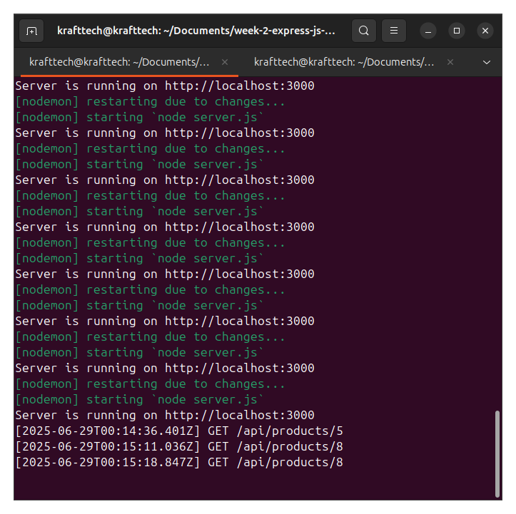

[](https://classroom.github.com/online_ide?assignment_repo_id=19865766&assignment_repo_type=AssignmentRepo)
# Express.js RESTful API Assignment

This assignment focuses on building a RESTful API using Express.js, implementing proper routing, middleware, and error handling.

## Assignment Overview

You will:
1. Set up an Express.js server
2. Create RESTful API routes for a product resource
3. Implement custom middleware for logging, authentication, and validation
4. Add comprehensive error handling
5. Develop advanced features like filtering, pagination, and search


## Files Included

- `Week2-Assignment.md`: Detailed assignment instructions
- `server.js`: Starter Express.js server file
- `.env.example`: Example environment variables file

## API Endpoints

The API will have the following endpoints:

| Method | Route               | Action            |
| ------ | ------------------- | ----------------- |
| GET    | `/api/products`     | Get all products  |
| GET    | `/api/products/:id` | Get product by ID |
| POST   | `/api/products`     | Add a new product |
| PUT    | `/api/products/:id` | Update a product  |
| DELETE | `/api/products/:id` | Delete a product  |




# 📦 Product API

Base URL: `http://localhost:3000/api/products`

## Endpoints

### 🔍 GET /api/products
Returns a list of all products.

**Response:**
```json
[
  {
    "id": "1",
    "name": "Laptop",
    "price": 1200
  },
  ...
]

# 📦 Product API

Base URL: `http://localhost:3000/api/products`

## Endpoints

### 🔍 GET /api/products
Returns a list of all products.

**Response:**
```json
[
  {
    "id": "1",
    "name": "Laptop",
    "price": 1200
  },
  ...
]

{
  "id": "1",
  "name": "Laptop",
  "price": 1200
}
 ### POST /api/products
Create a new product.

Headers:

Authorization: Bearer Opencell50

Content-Type: application/json

### PUT /api/products/:id
Update a product by ID.

DELETE /api/products/:id
Delete a product.


